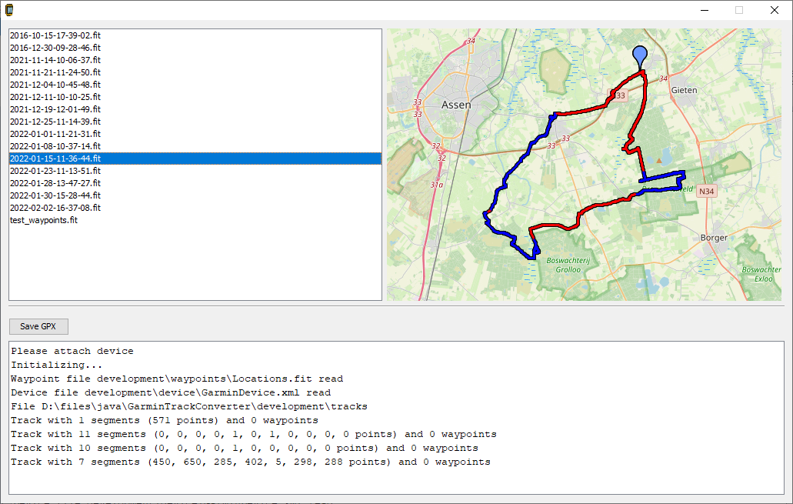
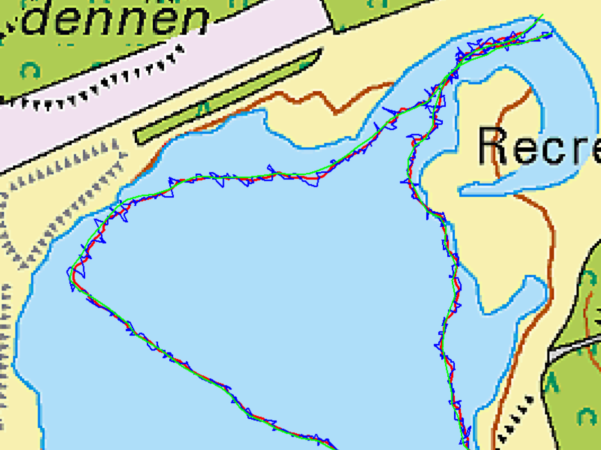
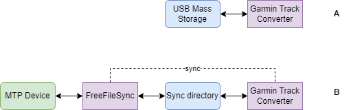

# Garmin Track Converter
## Introduction
### Goal
The **Garmin Track Converter** is an application intended to convert ANT/Garmin .FIT track or activity files containing GPS data from an attached Garmin device to a GPX 1.1 file containing track and waypoints. It can be used without the Garmin cloud applications.
It has been created for and tested with the Garmin Edge 810/830/1040 bike computer, Garmin Fenix 7 and recently GPSMAP 66sr and GPSMAP 67, but it might be useful for other Garmins devices as well.

Garmin .FIT tracks (activities) do not contain marked waypoints. These are stored in a separate file. On the Garmin Edge 810, 830 and 1040 this file is ```Locations.fit```, on the Fenix ```Lctns.fit```. On the GPSMAPs waypoints are stored in GPX files, one per day.
During conversion of the track, the converter checks the waypoint files and incorporates waypoints in the GPX that were logged during recording of the track (activity).

Garmin Track Converter can also be used to check the routes that are stored on the device and can be used to upload new waypoint or route files (it uses the feature of Garmin devices that imports GPX files that  are copied to /Garmin/NewFiles directory).



### Features
* Conversion of activity fit files to GPX 1.1
* Including waypoints logged during the activity
* GPX segments (\<trkseg\>) are based on (in this order)
  * start/stop events
  * laps
  * the logged trackpoints (GPSMAP 66sr, GPSMAP 67) *)
* Device ID/serial is included in the GPX
* Upload of waypoints and routes in GPX format (New Files)
* Smoothing and compression of activity tracks
* Simulation mode

*) There is an issue with GPSMAP 66sr and 67 with start/stop events, when activities are longer than 3 hours. The timestamps no longer are correct. Therefore in these cases we look at the track points and create segments when gaps appear between to subsequent trackpoints of more than 60 seconds.

### Local cache and file sync
The Garmin devices are more and more connected to the PC by means of the *Media Transport Protocol (MTP)* instead of USB file systems. Unfortunately Java does not have support for MTP. I solved this by using a tool FreeFileSync, to sync files between MTP device file system and a **local cache directory** on the Windows PC. FreeFileSync scripts can be executed by GarminTrackConverter. See the section below about operation mode. It's a pain in the ass, but the best I can think off...

So prerequisite is to download and install [FreeFileSync](https://freefilesync.org/download.php)

## Building and developement
Use Maven to compile the source files into /target. The project is recognized by Netbeans as Maven project and can be imported. It uses the [FitReader library](https://github.com/scubajorgen/FitReader), so be sure to import and build this project first. Manually building:

```
mvn clean install
```

When you run the application from the root directory, e.g.

```
java -jar target/GarminTrackConverter.jar
```
it uses the configuration file /garmintrackconverter.json. It simulates USB devices. The file usbsim.txt defines the devices that are simulated to be connected to the USB port.

```
###########################################################
# USB Device Simulation
# vendorID:productID (hexadecimal)
###########################################################
#091e:0003       # attaching
#091e:261f       # Edge 810
#091e:2c32       # Edge 830
091e:4f42       # Fenix 7
#091e:2f03       # Edge 1040
```

By default the Fenix 7 is simulated to be connected to the USB. However by commenting or uncommenting lines (add or remove the first '#'), you can change which device is connected.
The device files are placed in /development/device_[name], the local cache directory /development/sync_[name].

Default the local cache directories are empty. So attach a simulated USB device [name] and press the 'Sync' button: files are synced from /development/device_[name] to /development/sync_[name].

## Configuring
### Configuration file
The application requires a configuration file ```garmintrackconverter.json```. 
In this file the directories are defined on the device and where the GPX files should be written to. It appears that various types of Garmin devices have slightly different file structures. Therefore, multiple devices can be defined 
in the configuration.

```
{
    "debugLevel":"info",
    "debugSimulateUsb": true,
    "gpxFileDownloadPath": "./development/gpx",
    "gpxFileUploadPath": "./development/gpxRoutes",
    "gpxFileExtensions": "studioblueplanet",
    "trackCompression": true,
    "trackCompressionMaxError": 0.3,
    "trackSmoothing": false,
    "trackSmoothingAccuracy": 15.0,
    "showSyncWhenNoDeviceAttached": true,
    "usbConnectionStartVendorId": 2334,
    "usbConnectionStartProductId": 3,
    "devices":
    [
      {
        "name": "fenix 7 Solar",
        "type": "USBDevice",
        "usbVendorId": 2334,
        "usbProductId": 20290,
        "trackFilePath": "./development/sync_fenix7/GARMIN/Activity",
        "routeFilePath": "./development/sync_fenix7/GARMIN/Courses",
        "newFilePath": "./development/sync_fenix7/GARMIN/NewFiles",
        "locationFilePath": "./development/sync_fenix7/GARMIN/Location",
        "waypointFile": "./development/sync_fenix7/GARMIN/Location/Lctns.fit",
        "deviceFile": "./development/sync_fenix7/GARMIN/GarminDevice.xml",
        "syncCommand" : "\"c:\\Program Files\\FreeFileSync\\FreeFileSync.exe\" SyncFenixDev.ffs_batch",
        "devicePriority": 3
      },
      ...
    ]
}

```

The first section of the JSON are generic settings, the "devices" section contains the per device settings.

| Tag | Description |
|---|---|
| debugLevel                  | Debug logging level "debug", "info", "warn", "error" (for future purpose, doesn't work yet)           |
| debugSimulateUsb            | Simulate USB devices, for development. Default: false |
| gpxFileDownloadPath         | Default path where to save GPX files |
| gpxFileUploadPath           | Default path where to look for upload files |
| gpxFileExtensions           | Defines which extensions to use for GPX files |
| trackCompression            | Default value for the track compression checkbox |
| trackCompressionMaxError    | The maximum allowed error in m when compressing a track. The larger the error, the more compression. 0.3 m is a good value |
| trackSmoothing              | Default value for the track smoothing checkbox |
| trackSmoothingAccuracy      | Pameter defining the track smoothing 15.0 is a good value |
| showSyncWhenNoDeviceAttached| Show the local cache when no device is attached, or show nothing |
| usbConnectionStartVendorId  | Some garmin devices first connect as this vender/product |
| usbConnectionStartProductId | Some garmin devices first connect as this vender/product |


Per device:

| Tag | Description |
|---|---|
| name              | Display name |
| type              | Defines how the device is attached: "USBDevice" for MTP, "USBMassStorage" as it attaches as USB file system |
| usbVendorId       | Vender ID of the device. For Garmin devices: 2334 |
| usbProductId      | Product ID of the device |
| trackFilePath     | Place to look for activities. For "USBMassStorage" devices it is the directory on the device itself, for "USBDevice" it is the **local cache directory**. In the latter case: use FreeFileSync to get the files from the MTP device to the **local cache directory** |
| routeFilePath     | Place where the routes or courses are stored on the device or cache |
| newFilePath       | Place where to put new files on the device or cache |
| locationFilePath  | Place where to find the location file or files |
| waypointFile      | Name of the waypoint file. Usually 'Locations.fit' or 'Lctns.fit'. Leave empty for GPSMAPs, which stores the waypoints in multiple GPX files |
| deviceFile        | Locations and Name of the device XML file |
| syncCommand       | The full command to run a FreeFileSync batch job to synchronize between device and local cache directory |
| devicePriority    | When multiple devices are attached, the device with the lowest priority is shown, unless the user selected another from the Device Menu |

In the directory /development example file structures are available for the Garmin Edge 1040, Garmin Edge 810, Garmin Edge 830 (/development/device_edge830) and Garmin Fenix 7 (/development/device_fenix7) and GPSMAP 66sr and GPSMAP 67. The files and directories are (partly) copied from real devices.

## Preparing for execution
* Create a directory
* Copy GarminTrackConverter.jar
* Create batch jobs for FreeFileSync
* Create a garmintrackconver.json

Examples in /src/main/resouces_run

## Executing
Execute

```
java -jar GarminTrackConverter.jar
```

If all is configured properly, you see four panels to the left, one map panel to the right and one info box at the bottom.

The four panels represent:
* The logged activities (top left)
* The courses on the the device (top right)
* The logged waypoints file (bottom left)
* The new uploaded files (bottom right)

Clicking any of the files shown shows the contents on the map on the right side of the screen.

Buttons: 
* Save GPX: saves the last clicked track/activity
* Upload: Uploads a .gpx file containing trk, rte or wpt to the new uploaded files
* Delete: Delete the selected file in any of the panels

Note that this program has only be tested with the Garmin **Edge810**, **Edge830** and **Edge1040** bike computers, the **Fenix 7**, the **GPSMAP 66sr** and the **GPSMAP 67**. 

## Compression
A feature is _track compression_ by means of the [Douglas-Peucker algorithm](https://en.wikipedia.org/wiki/Ramer%E2%80%93Douglas%E2%80%93Peucker_algorithm). Compressing a track means omitting trackpoints that do not contribute much to the track: if three trackpoints lie more or less on a line, the trackpoint that is in the middle can be omitted without changing the track to much. 

On the Fenix 7, the frequency of trackpoints can be set to 'smart'. The device compresses the track. For Open Water Swimming however it does not seem to have effect: every second a point is logged. Here comes in the compression feature.

Compressing can be switched on by checking the 'Save compressed track' checkbox. The setting 'trackCompression' in the settings file can be used to have it checked by default. 

The algorithm requires a maximum allowable error value. This can be defined in the settings file by 'trackCompressionMaxError', in m: the larger the value the higher the compression ratio but the more deviation occurs. A value of 0.3 m gives good results.

```
  "trackCompression": true,
  "trackCompressionMaxError": 0.3
```

## Smoothing
The software offers the feature _smoothing_, based on a Kalman filter. Normally track smoothing is not necessary, because the Garmins are quite accurate. However, in exceptional cases it may come handy. In next picture I used the Fenix 7 on my wrist to log a swim using a generic activity. This results in a fairly jagged track (blue), because half the time the GPS is under water. Using the smoothing feature it results in a smoothed track (red) pretty good matching the curve of a TomTom GPS attached to the swimming buoy (green). 



Distances logged:
* TomTom reference (green): 1.65 km 
* Original Fenix (blue): 3.74 km (+127%)
* Smoothed Fenix (red): 1.72 km (+4%)

If the GPS provides the accuracy of the GPS (ehpe), this is used. Most likely your GPS does not. Than you can set the accuray in the configuration file, in m:
```
"trackSmoothingAccuracy": 15.0
```
Only use smoothing for cases like the case above. Applying it to normal tracks makes it cut corners.

## Development
The software was developed using Apache Netbeans. The Maven project can be run or debugged from Netbeans. For developement, a directory /development is available. It contains in /development/Garmin a copy of the filestructure from a Garmin Edge830 device, including some logged activities, courses and locations. The folder /development/gpx can be used to store GPX files.

The GarminTrackConverter.properties file in the root of the project is used by Netbeans and is configured to use the /development folder 

## Dependencies
The software uses 
- [the FitReader project](https://github.com/scubajorgen/FitReader)
- hirondelle-date4j-1.5.1.jar
- appframework-1.0.3.jar
- swing-worker-1.1.jar
- ...

## Operation mode: USB Mass Storage or USB Device
Some Garmin devices like the Edge 810, the Edge 830 and Edge 1040 behave like an _USB mass storage device_. A Java program can simply access this file system (image A in the image below)



Unfortunatelly, newer devices like the Fenix 7 cannot be attached to USB as _mass storage device_. Instead, it is mounted using MTP (Media Transfer Protocol). Under Windows it is mapped under 'This PC' as an USB Device . From Java Programs the files are **not** accessible (at least, I didn't find a way...). 

I tried [Mtpdrive](https://www.mtpdrive.com/) which is a program that assigns a drive letter to an MTP device so it should be accessible as regular disk/storage. However, it is quircky in combination with Java file I/O. Sometimes Java file I/O is exteremely slowly. And each time an MTP device is attached the mapping must be made manually. Not workable.

I came up with a workaround using an external file synchronization program [FreeFileSync](https://freefilesync.org/) that syncs the device to a local directory structure on your HDD. This is shown in image B. You can define a commandline file sync command with each device in the settings file. If it is defined (i.e. not equal to ""), a sync button becomes visible which you can use to sync to and from the device. Enclosed in the source code is a FreeFileSync batch file that can be executed to sync. Adapt it for your own usage.

## Information
* [Blog](http://blog.studioblueplanet.net/?page_id=468)
* [Source](https://github.com/scubajorgen/GarminTrackConverter)

# License
This software is published under the MIT license:

*Copyright (c) 2024 Jörgen*

*Permission is hereby granted, free of charge, to any person obtaining a copy
of this software and associated documentation files (the "Software"), to deal
in the Software without restriction, including without limitation the rights
to use, copy, modify, merge, publish, distribute, sublicense, and/or sell
copies of the Software, and to permit persons to whom the Software is
furnished to do so, subject to the following conditions:*

*The above copyright notice and this permission notice shall be included in all
copies or substantial portions of the Software.*

*THE SOFTWARE IS PROVIDED "AS IS", WITHOUT WARRANTY OF ANY KIND, EXPRESS OR
IMPLIED, INCLUDING BUT NOT LIMITED TO THE WARRANTIES OF MERCHANTABILITY,
FITNESS FOR A PARTICULAR PURPOSE AND NONINFRINGEMENT. IN NO EVENT SHALL THE
AUTHORS OR COPYRIGHT HOLDERS BE LIABLE FOR ANY CLAIM, DAMAGES OR OTHER
LIABILITY, WHETHER IN AN ACTION OF CONTRACT, TORT OR OTHERWISE, ARISING FROM,
OUT OF OR IN CONNECTION WITH THE SOFTWARE OR THE USE OR OTHER DEALINGS IN THE
SOFTWARE.*