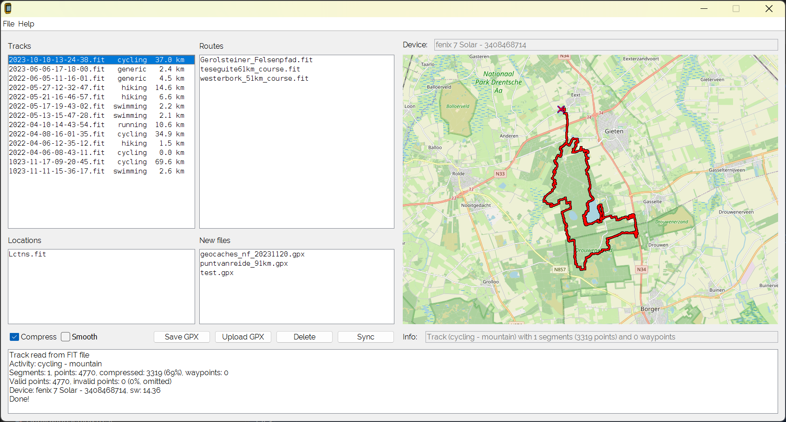

# Garmin Track Converter
## Introduction
The **Garmin Track Converter** is an application intended to convert ANT/Garmin .FIT track or activity files containing GPS data from an attached Garmin device to a GPX 1.1 file containing track and waypoints. 
It has been created for and tested with the Garmin Edge 810/830 bike computer and Garmin Fenix 7, but it might be useful for other Garmins devices as well.

Garmin .FIT tracks (activities) do not contain marked waypoints. These are stored in a separate file. On the Garmin Edge810 this file is Locations.fit, on the Fenix Lctns.fit.
During conversion of the track, the converter checks the waypoint file and incorporates waypoints in the GPX that were logged during recording of the track (activity).

Garmin Track Converter can also be used to check the routes that are stored on the device and can be used to upload new waypoint or route files (it uses the feature of Garmin devices that imports GPX files that  are copied to /Garmin/NewFiles directory).



Features
* Conversion of activity fit files to GPX 1.1
* Including waypoints logged during the activity
* Start/stop events are written to trkseg GPX segments
* Device ID/serial is included in the GPX
* Upload of waypoints and routes in GPX format (New Files)
* Smoothing and compression of activity tracks

## Building
Use Maven to compile the source files into /target. The project is recognized by Netbeans as Maven project and can be imported. It uses the [FitReader library](https://github.com/scubajorgen/FitReader), so be sure to import and build this project first. Manually building:

```
mvn clean install
```

## Running
```
java -jar target/GarminTrackConverter.jar
```

## Configuring
The application requires a configuration file ```garmintrackconverter.json```. 
In this file the directories are defined on the device and where the GPX files should be written to. It appears that various types of Garmin devices have slightly different file structures. Therefore, multiple devices can be defined 
in the configuration.

```
{
  "debugLevel":"info",
  "gpxFileDownloadPath": "d:/gps/gpx",
  "gpxFileUploadPath": "d:/gps/routes",
  "gpxFileExtensions": "studioblueplanet",
  "trackCompression": false,
  "trackCompressionMaxError": 0.3,
  "trackSmoothing": false,
  "trackSmoothingAccuracy": 15.0,
  "showSyncWhenNoDeviceAttached": false,
  "devices":
  [
    {
      "name": "fenix 7 Solar",
      "type": "USBDevice",
      "usbVendorId": 2334,
      "usbProductId": 20290,
      "trackFilePath": "d:/gps/fenix/GARMIN/Activity",
      "routeFilePath": "d:/gps/fenix/GARMIN/Courses",
      "newFilePath": "d:/gps/fenix/GARMIN/NewFiles",
      "locationFilePath": "d:/gps/fenix/GARMIN/Location",
      "waypointFile": "d:/gps/fenix/GARMIN/Location/Lctns.fit",
      "deviceFile": "d:/gps/fenix/GARMIN/GarminDevice.xml",
      "syncCommand": "\"c:\\Program Files\\FreeFileSync\\FreeFileSync.exe\" SyncFenixTwoWay.ffs_batch",
      "devicePriority": 2
    },
    {
      "name": "Edge 830",
      "type": "USBMassStorage",
      "usbVendorId": 2334,
      "usbProductId": 11314,
      "trackFilePath": "f:/Garmin/Activities",
      "routeFilePath": "f:/Garmin/Courses",
      "newFilePath": "f:/Garmin/NewFiles",
      "locationFilePath": "f:/Garmin/Locations",
      "waypointFile": "f:/Garmin/Locations/Locations.fit",
      "deviceFile": "f:/Garmin/GarminDevice.xml",
      "syncCommand": "",
      "devicePriority": 1
    }
  ]
}

```

It requires from the device:
* USB vendor ID end product ID
* The directory containing the tracks (activities, \Garmin\activities)
* The file containing the device info (\Garmin\GarminDevice.xml)
* The waypoint file (\Garmin\Locations\Locations.fit)
* The new files location (\Garmin\NewFiles)

In the directory /development example file structures are available for the Garmin Edge 830 (/development/device_edge830) and Garmin Fenix 7 (/development/device_fenix7). The files and directories are (partly) copied from real devices.

## Executing
Go to /target directory. Run 'java -jar GarminTrackConverter.jar. The jar file is containing all depenedencies.

If all is configured properly, you see four panels to the left, one map panel to the right and one info box at the bottom.

The four panels represent:
* The logged activities (top left)
* The courses on the the device (top right)
* The logged waypoints file (bottom left)
* The new uploaded files (bottom right)

Clicking any of the files shown shows the contents on the map on the right side of the screen.

Buttons: 
* Save GPX: saves the last clicked track/activity
* Upload: Uploads a .gpx file containing trk, rte or wpt to the new uploaded files
* Delete: Delete the selected file in any of the panels

Note that this program has only be tested with the Garmin **Edge810** and **Edge830** bike computers and the **Fenix 7**. 

## Compression
A feature is _track compression_ by means of the [Douglas-Peucker algorithm](https://en.wikipedia.org/wiki/Ramer%E2%80%93Douglas%E2%80%93Peucker_algorithm). Compressing a track means omitting trackpoints that do not contribute much to the track: if three trackpoints lie more or less on a line, the trackpoint that is in the middle can be omitted without changing the track to much. 

On the Fenix 7, the frequency of trackpoints can be set to 'smart'. The device compresses the track. For Open Water Swimming however it does not seem to have effect: every second a point is logged. Here comes in the compression feature.

Compressing can be switched on by checking the 'Save compressed track' checkbox. The setting 'trackCompression' in the settings file can be used to have it checked by default. 

The algorithm requires a maximum allowable error value. This can be defined in the settings file by 'trackCompressionMaxError', in m: the larger the value the higher the compression ratio but the more deviation occurs. A value of 0.3 m gives good results.

```
  "trackCompression": true,
  "trackCompressionMaxError": 0.3
```

## Smoothing
The software offers the feature _smoothing_, based on a Kalman filter. Normally track smoothing is not necessary, because the Garmins are quite accurate. However, in exceptional cases it may come handy. In next picture I used the Fenix 7 on my wrist to log a swim using a generic activity. This results in a fairly jagged track (blue), because half the time the GPS is under water. Using the smoothing feature it results in a smoothed track (red) pretty good matching the curve of a TomTom GPS attached to the swimming buoy (green). 


Distances logged:
* TomTom reference (green): 1.65 km 
* Original Fenix (red): 3.74 km (+127%)
* Smoothed Fenix (blue): 1.72 km (+4%)

If the GPS provides the accuracy of the GPS (ehpe), this is used. Most likely your GPS does not. Than you can set the accuray in the configuration file, in m:
```
"trackSmoothingAccuracy": 15.0
```
Only use smoothing for cases like the case above. Applying it to normal tracks makes it cut corners.

## Development
The software was developed using Apache Netbeans. The Maven project can be run or debugged from Netbeans. For developement, a directory /development is available. It contains in /development/Garmin a copy of the filestructure from a Garmin Edge830 device, including some logged activities, courses and locations. The folder /development/gpx can be used to store GPX files.

The GarminTrackConverter.properties file in the root of the project is used by Netbeans and is configured to use the /development folder 

## Dependencies
The software uses 
- [the FitReader project](https://github.com/scubajorgen/FitReader)
- hirondelle-date4j-1.5.1.jar
- appframework-1.0.3.jar
- swing-worker-1.1.jar
- ...

## Operation mode: USB Mass Storage or MTB Device
Some older Garmin devices like the Edge 810 and Edge 830 behave like an _USB mass storage device_. A Java program can simply access this file system (image A in the image below)


Unfortunatelly, newer devices like the Fenix 7 cannot be attached to USB as _mass storage device_. Instead, it is mounted using MTP (Media Transfer Protocol). Under Windows it is mapped under 'This PC' as an USB Device . From Java Programs the files are **not** accessible. 

I tried [Mtpdrive](https://www.mtpdrive.com/) which is a program that assigns a drive letter to an MTP device so it should be accessible as regular disk/storage. However, it is quircky in combination with Java file I/O. Sometimes Java file I/O is exteremely slowly. And each time an MTP device is attached the mapping must be made manually. Not workable.

I came up with a workaround using an external file synchronization program [FreeFileSync](https://freefilesync.org/) that syncs the device to a local directory structure on your HDD. This is shown in image B. You can define a commandline file sync command with each device in the settings file. If it is defined (i.e. not equal to ""), a sync button becomes visible which you can use to sync to and from the device. Enclosed in the source code is a FreeFileSync batch file that can be executed to sync. Adapt it for your own usage.

## Information
* [Blog](http://blog.studioblueplanet.net/?page_id=468)
* [Source](https://github.com/scubajorgen/GarminTrackConverter)
